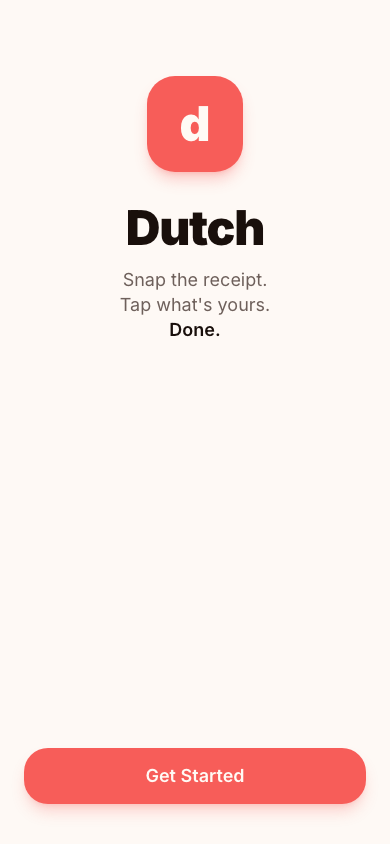
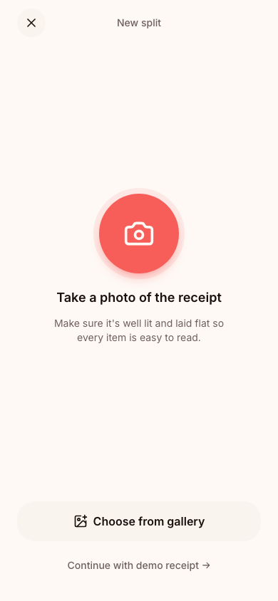
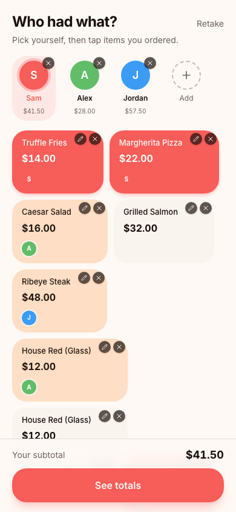
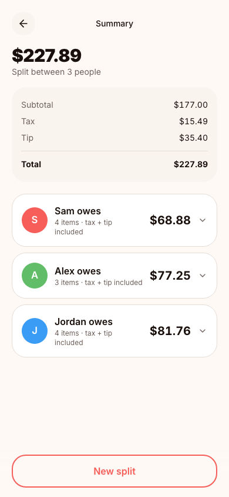

# Dutch

Dutch is a small app for splitting a restaurant bill. Take a photo of the receipt, tap what you had, and it works out who owes what, including tax and tip.

## Screenshots

| Welcome | Capture | Claim | Summary |
| --- | --- | --- | --- |
|  |  |  |  |

## How it works

1. Take a photo of the receipt, or upload one from your gallery.
2. The app reads it with Gemini and pulls out each item and price.
3. Pick yourself from the people list, then tap the items you had. Shared items split automatically between whoever taps them.
4. See the final breakdown, with tax and tip divided fairly based on what each person actually ordered.

If a line has more than one of something, like two glasses of wine, you can split it into separate items so two people can each claim their own instead of splitting the cost down the middle.

You can also edit a price by hand, add an item that wasn't on the receipt, or add and remove people as needed.

## Running it locally

```bash
npm install
npm run dev
```

You'll need a free Gemini API key from [aistudio.google.com/apikey](https://aistudio.google.com/apikey). Copy `.env.example` to `.env` and add it there:

```
GEMINI_API_KEY=your-key-here
```

Without a key, the app still works using a built-in demo receipt.

## Built with

- TanStack Start (React, Vite)
- Gemini for reading receipts
- Tailwind CSS

It's installable as a PWA on both iOS and Android, and everything runs on free tiers.

## Notes

Bill data is saved to your browser's local storage, so it's still there if you close the tab or refresh. There's no account and no server-side database, everything stays on your device except the photo sent to Gemini for reading the receipt.
